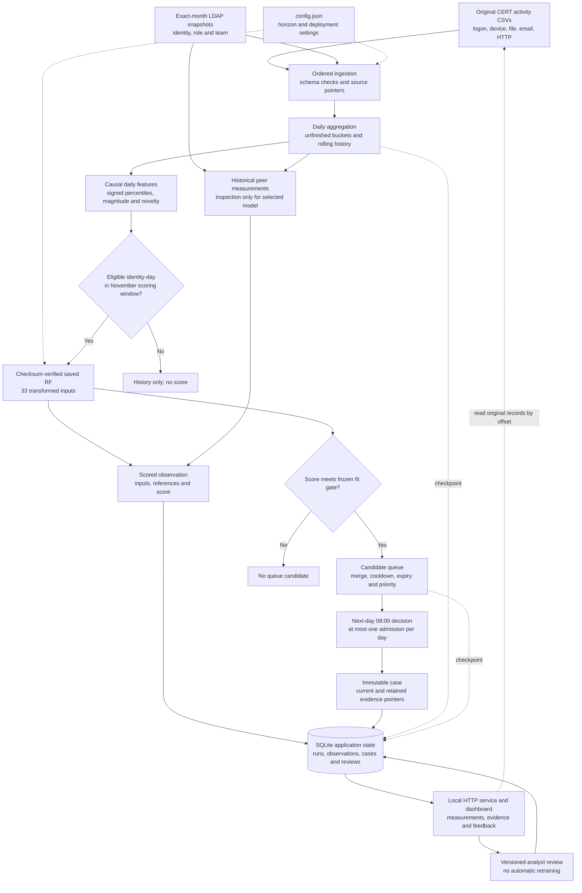
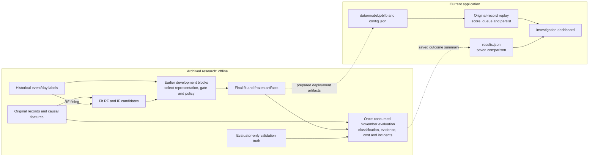

# SentinelID architecture

This document describes the implemented application and its boundary with archived research. The Mermaid diagrams render in compatible Markdown viewers, including GitHub. Runtime settings come from `config.json`; the saved artifact fixes model behavior.

## Operational pipeline



Eligibility precedes prediction. Eligible scores below the gate are still stored. Peer measurements are retained in audit payloads; no peer-feature edge feeds the selected RF. The displayed gate is approximately 0.405628; inference uses the exact value in the model bundle.

## Components

| Component | Implementation | Input → output |
| --- | --- | --- |
| Ingestion | `sentinelid/ingestion.py` | CSV and monthly LDAP → ordered normalized records with original pointers |
| Behavioral history | `sentinelid/features.py` | Records → daily counts, lagged references, features, eligibility and context |
| Scoring and admission | `sentinelid/pipeline.py` | Eligible vectors → scores, candidates, admission decisions and cases |
| Persistence | `sentinelid/store.py` | Checkpoints, observations and cases → atomic SQLite state; feedback → versioned reviews |
| Local service | `sentinelid/server.py` | HTTP queries/commands → replay control, case inspection and review updates |
| Interface | `dashboard/` | Service responses → tables, measurements and original evidence |
| Entry point | `sentinelid/__main__.py` | CLI arguments → verification, status, server or replay |

### Data and time contract

- Two disjoint source shards cover May 1–November 30, 2010. Records sort by timestamp and source-qualified event ID; source timestamp inversions are rejected.
- Role and team use the record's exact calendar month; future LDAP snapshots are not carried backward.
- Targets cover 1, 3 and 7 days. Personal references use 28 endpoints ending before a seven-day lag. Multi-day references need six additional preceding days.
- Eligibility requires at least 41 calendar days of history, seven active base-source reference days, current base activity and supported source coverage.
- The feature code accepts explicit coverage state, but active replay has no outage feed. It assumes prepared complete shards; production source-quality monitoring is future work.
- RF receives 13 signed percentile, 13 magnitude and 7 novelty/timing inputs. Magnitude and novelty values use `log1p`; percentiles remain signed.
- Scoring covers November only. Days close at midnight; admission decisions follow at 08:00. Replay uses dataset time, not the computer's current date.

### Admission contract

The selected `max_cooldown` policy retains each identity's maximum pending score and merges recurring evidence. A seven-day post-admission cooldown suppresses further candidates. A pending candidate expires when its first availability time is more than three days old. Each decision admits at most one available candidate; the queue is not forced to fill its budget.

Fresh-priority and conditional-reopening alternatives remain in the implementation, but are not selected. Changing configuration does not establish a better policy or make a consumed validation interval available for new selection.

## Research and runtime boundary



Validation truth has no edge into active features, scoring or admission. The dashboard reads saved benchmark results; it does not evaluate its current run. Analyst dispositions are separate records, not benchmark labels or a training signal.

Final fitting used June 8–October 14. Label-free workload calibration used October 15–21. November 1–30 outcomes were evaluated after the declared freeze. Deployment uses the fitting-score gate selected during earlier development. The full protocol and previous rule/simulation implementations remain in the recovery archive.

## Checkpoint and recovery

```mermaid
sequenceDiagram
    participant CLI as CLI or background worker
    participant Replay as WorkloadReplay
    participant Source as Original CSV readers
    participant State as History and queue
    participant DB as SQLite
    CLI->>Replay: Open latest run
    Replay->>Replay: Verify model and acquire writer lock
    Replay->>DB: Read run identity and checkpoint
    DB-->>Replay: Cursor, last key, unfinished history and queue
    Replay->>Replay: Require matching configuration identity
    Replay->>Source: Scan shard and skip through committed last key
    loop Bounded event batch
        Source-->>Replay: Next ordered record
        Replay->>State: Update history; score closed days; decide admissions
    end
    Replay->>DB: BEGIN IMMEDIATE
    Replay->>DB: Insert observations and cases
    Replay->>DB: Save cursor and complete checkpoint
    alt All writes succeed
        Replay->>DB: COMMIT
    else A write fails
        Replay->>DB: ROLLBACK
    end
    Note over Replay,DB: Restart restores the last committed batch
    CLI->>Replay: Pause after a batch or close worker
    Replay->>Replay: Release writer lock
```

The checkpoint contains the last `(timestamp, event_id)` key, cursor, unfinished buckets, rolling history, queue, retained pointer cache and pending decision. Observations, cases and cursor updates share one transaction. After a failed batch, discard the worker and reopen from committed state. Resume scans within the relevant shard; indexed source seeking is not implemented.

## Evidence and feedback

Cases retain original event IDs, CSV paths, byte offsets, row numbers and contextual relationships rather than copying entire source content. Inspection seeks to an offset and verifies the event ID before displaying fields. Measurements include the exact transformed model vector, reference statistics and peer context.

Evidence explains aggregate context; exact forest-to-event attribution is not computed. Cases remain immutable. Review writes append a new version and reject stale edit versions. Feedback does not change benchmark labels, scores or admission decisions. Existing pointers use absolute paths, which must be accounted for when moving a saved demo.

## Current boundaries

The app is a local research demonstration with a fixed benchmark horizon. Live identity-provider connectors, production authentication, automated retraining, an outage feed and a short checkpoint-based demo preset are not implemented. Archived full evaluation and current operational replay are distinct execution paths.
