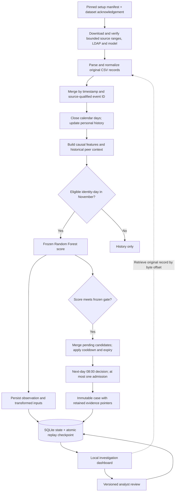

# SentinelID — Complete Project Summary

**Identity attack detection using behavioral analytics, causal event replay and evidence-based investigation**

**Status as of October 6, 2026:** working academic and portfolio prototype, with a frozen model, a completed original-record replay, an investigation interface and preserved research experiments.

This document describes the project in one place: its purpose, development history, dataset, architecture, feature methodology, models, operational behavior, evaluation, verification, setup and remaining work. It distinguishes the maintained application from historical experiments stored in the local recovery archive.

## 1. Purpose and problem

SentinelID investigates whether activity associated with a user identity can reveal suspicious behavioral changes, and whether those changes can be turned into useful investigations at a limited review budget.

The motivating behaviors include unusual removable-media use, increased copying, changes in login timing or workstation use, external email activity and changes in browsing. A single unusual event is not necessarily an attack. The project therefore measures behavior against historical personal activity, combines measurements in a detector, and retains original evidence for human investigation.

The project has two connected objectives:

- **Academic:** investigate feature semantics, compare rules and machine learning, reserve chronological evaluation periods, measure incident coverage and investigation cost, and report negative or inconclusive findings honestly.
- **Development and portfolio:** build a working path from dataset acquisition through ingestion, history, features, scoring, admission, durable state, evidence inspection and analyst feedback.

The implemented benchmark scope is insider-threat behavior in CERT r4.2. It does not directly establish detection of every identity attack, such as credential theft, session hijacking or attacks against a live identity provider. The dataset is synthetic; the project uses original benchmark records rather than locally generating demonstration activity.

## 2. What exists now

| Area | Current state |
| --- | --- |
| Data acquisition | Maintained setup command downloads pinned source ranges, monthly LDAP snapshots and the matching model |
| Parsing and ingestion | Five sources, strict record/schema checks, exact-month identity context and deterministic ordered replay |
| Behavioral features | Causal daily personal references, multiple activity horizons, magnitude, signed percentiles and novelty |
| Peer context | Historical, supported, self-excluding peer measurements available for inspection |
| Deployed detector | Frozen supervised Random Forest using 33 personal behavioral inputs |
| Investigation admission | Threshold, pending-candidate merging, one admission per decision day, cooldown and expiry |
| Persistence and recovery | SQLite observations/cases/reviews and atomic serialized replay checkpoints |
| Investigation interface | Local dashboard with progress, cases, measurements, transformed inputs, original evidence and review history |
| Operational validation | Completed replay of 14,143,645 records with 18,772 scores and 31 cases |
| Research evaluation | Historical rules/ML comparisons, recovery experiments and final RF/IF workload comparison preserved |
| Delivery simulations | Earlier research implementations preserved; not a complete fault-injection suite for the current RF deployment |
| Training and full evaluation | Historical implementations archived; not maintained CLI commands in the slim application |
| Repository | Public GitHub source repository, pinned dependencies, ignored runtime artifacts and dataset-free CI |

The original-record operational path is implemented end to end. The public application is not a single-command system for rerunning every historical training, simulation and evaluation experiment. Those stages are preserved separately.

## 3. Development history and lessons

### 3.1 Initial rule-based demonstration

Development began with a small, inspectable rule-based system and original CERT activity. The aim was to expose events, behavioral references, detections and evidence clearly rather than present only attractive dashboard summaries.

Earlier rules and anomaly detectors supported exploration of ingestion, replay, grouping, persistence and delivery simulations. The UI was subsequently focused on showing the measurements and source records behind a case.

### 3.2 Supervised model and classification-versus-pipeline comparison

An earlier supervised Random Forest, designated **S2**, was compared with frozen rules **R**. This experiment used logon, device and removable-copy data at the active identity-hour level; it is different from the current five-source identity-day system.

On the already-consumed August 1–14 cohort:

| Earlier detector | Hourly TP / FP / FN / TN | Precision | Recall | Average precision | Threshold cases |
| --- | --- | --- | --- | --- | --- |
| Rules R | 4 / 12 / 132 / 28,870 | 25.00% | 2.94% | 0.0193 | 11 |
| Random Forest S2 | 10 / 37 / 126 / 28,845 | 21.28% | 7.35% | 0.0580 | 43 |

Both missed all **111 scenario-2 positive hours** at their frozen thresholds. An always-negative classifier achieved **99.53% accuracy**, demonstrating why raw accuracy was misleading. Better ranking or hourly recall did not automatically produce better investigations at the review budget.

The archived report also verified a fresh replay of 231,628 records against frozen outputs and tested a separate-process restart. These results are historical descriptive measurements, not an independent test repeated for this summary.

### 3.3 Targeted detection recovery

Diagnostics investigated ordinary login-time variation, limited attack diversity in fitting labels, ambiguous missing/history states and the inability of hourly predicates to capture recurrent behavior.

The recovery milestone introduced continuous calendar history, daily and multi-day behavior, additional email/HTTP measurements, evidence-aware investigation admission and broader outcome evaluation. Its selected **IX28 Isolation Forest** reached **9 of 10 October incidents with 60 investigations**, while the frozen rules reached two with 12 and S2 reached two with 23. IX28's first 12 chronological investigations reached one incident. More total coverage therefore did not establish improvement at comparable workload.

Evidence inspection also found a concrete schema defect: the mirror used the email field `attachments`, while an earlier feature path expected `attachment_count`. Frozen artifacts were preserved. A separate adapter accepted explicit aliases, rejected missing/conflicting values and retained provenance. Inspection established that the selected IX28 trees did not use the corrected dimension, so correcting that input could not change its selected forest scores. Other attachment-dependent experiments remained limited by the original defect.

### 3.4 Workload-focused representation and model experiments

The next milestone examined corrected Isolation Forest fitting, personal count-change representations, signed percentiles, percentile-plus-magnitude representations, historical peer context, gate calibration and queue alternatives under chronological development blocks.

A key representation issue was **percentile saturation**: different extreme behavior values can occupy the same historical rank. Pairing percentile direction with change magnitude retains information beyond that bounded rank. Peer context required adequate historical support and exclusion of the target user.

The development-selected deployment became **REP_RF / PM / fit / max_cooldown**, evaluated on November. Its measured reach and positive-investigation yield were higher than the corrected IF baseline, but it used one additional investigation. The declared formal verdict remained **improvement not established**.

### 3.5 Consolidation and reproducible setup

The project was reduced to a small maintained package, three dashboard files and compact configuration/results documents. Historical code, reports, models and consumed outcomes were moved into a verified local recovery archive. Existing scores, admission decisions, evidence and analyst reviews were preserved.

The repository was initialized and published as [lazinWolf/SentinelID](https://github.com/lazinWolf/SentinelID). Setup was then extended to reproduce the exact source/model contract from a fresh checkout, with the pretrained model distributed as a separate GitHub Release asset.

## 4. Dataset and artifact contract

### 4.1 Sources and size

The active pipeline uses CERT r4.2 records from **May 1 through November 30, 2010**, with December 1 as the exclusive end boundary.

| Source | Records in the complete selected period | Behavioral use |
| --- | ---: | --- |
| Logon | 370,699 | Login count, after-hours activity, timing and workstation context |
| Device | 177,762 | Removable-media connection activity |
| File | 192,947 | Removable-media copying activity in this source contract |
| Email | 1,135,158 | External recipients, message bytes, attachment count and recipient/domain novelty |
| HTTP | 12,267,079 | Visit count and host novelty |
| **Total activity records** | **14,143,645** | Ordered original-record replay |

Monthly LDAP snapshots provide user, role and team context. LDAP rows are not included in the activity-record total.

The source period is divided into two disjoint prepared shards:

- `data/raw/recovery-v3/`: May 1–October 14, with May–October LDAP snapshots.
- `data/raw/workload-v4/`: October 15–November 30, with October–November LDAP snapshots.

October LDAP appears in both shards because both need that month's context; activity records do not overlap.

### 4.2 Acquisition and reproducibility

`setup-manifest.json` records the pinned dataset mirror revision, URLs, exact byte ranges, expected download hashes, prepared CSV hashes, row counts, file sizes and monthly metadata hashes. The mirror revision is `010e4562bb025ea15ea73c7a1f9231037b237ad2`.

Setup requests bounded byte ranges instead of downloading the entire large CERT release. It discards incomplete boundary lines, checks chronological order and complete date boundaries, selects the declared period, and serializes CSVs according to the frozen contract. The prepared file is installed only after its size, row count and checksum match.

Transfers use partial files, resume from the downloaded byte count, validate HTTP range responses, and check complete transfer length and SHA-256. Existing matching artifacts are reused. Existing differing artifacts produce an error instead of being overwritten. Setup uses a process lock and leaves the application database, frozen results and configuration unchanged.

These checks establish equality to the declared acquired artifacts. They do not certify equality to a completely downloaded official CERT archive. Source selection does not consult attack answers or select only malicious users. Active setup does not fetch answer labels.

The model is downloaded from [the deployment-model release](https://github.com/lazinWolf/SentinelID/releases/tag/setup-assets-v1) and verified against the identity in `config.json` before runtime loading.

### 4.3 Terms and storage

Dataset terms are separate from this project's code. Full setup requires explicit acknowledgement through `--accept-data-license`. Original dataset files are excluded from Git; the project does not grant a new dataset license.

Allow approximately **7 GB of downloads and 15 GB free disk space** for preparation. Full replay can take considerable time. The repository contains no completed application database, so a fresh installation needs replay before cases become available.

Official dataset reference: [CERT Insider Threat Test Dataset record](https://doi.org/10.1184/R1/12841247.v1). The setup manifest links the pinned mirror's dataset terms. Copyright © 2011 ExactData, LLC. All Rights Reserved.

## 5. Complete implemented flow



Validation labels are an offline evaluation input. They do not feed the current scorer, queue or analyst interface. `results.json` supplies a saved benchmark comparison; the dashboard does not recompute evaluation outcomes for its current run.

## 6. Ingestion, identity context and simulated time

Each normalized record retains a source-qualified event ID, timestamp, identity, computer, action, role, metadata month, original fields, source path, row number and byte offset.

Within each source, timestamps must be nondecreasing. Equal-time records are ordered by event ID; source streams are merged by `(timestamp, event_id)`. Malformed records, unsupported timestamps and invalid email attachment schemas are rejected rather than silently interpreted as normal activity.

Role and team come from the exact calendar month of the event. Future LDAP snapshots are not carried backward. Missing identity metadata remains explicit rather than being replaced by future information.

The replay clock follows dataset time. A day closes when the stream advances into the next date; unfinished buckets are checkpointed. The computer's current date does not determine scoring or investigation availability.

This is an ordered historical replay, not a live message broker. The current application rejects late ordering and does not implement a general late-event reconciliation or production outage-management service.

## 7. Behavioral methodology and model inputs

### 7.1 Aggregation and eligibility

The scoring unit is an **eligible active identity-day**. Activity is aggregated into counts and sets, including connected devices, copied files, logons, after-hours logons, external email, message bytes, attachments, HTTP visits, computers, recipients, domains and hosts.

After-hours logons currently mean hours before 07:00 or at/after 19:00. An email is external when a recipient domain differs from the benchmark's internal `dtaa.com` domain. Message size is interpreted as message bytes excluding attachments; attachment count is a separate feature.

Eligibility requires current base activity in logon/device/file, at least **41 calendar days** since the history start, at least **seven active base-source reference days**, and supported source coverage. Email/HTTP and the extra historical days used by multi-day percentiles must also be covered.

Missing calendar days contribute zero activity only when source coverage is assumed available. The feature implementation accepts an explicit coverage map; current prepared-data replay has no outage feed and assumes complete declared shards. Source outages must not be treated as inactivity in a future live integration.

### 7.2 Personal history and change magnitude

**Historical-contract limitation identified October 7:** the deployed v4 three-day USB/copy magnitude target uses `d, d−5, d−6`, while percentiles use `d, d−1, d−2`. The methodology below describes intended target horizons. The default model remains bound to its historical inputs; the isolated `behavior-experiment-v1` contract corrects the magnitude chronology and refits models. See [the investigation](reports/UNSUPERVISED_INVESTIGATION.md) and [optional experiment methodology](EXPERIMENTS.md).

Targets use one-, three- and seven-day behavior. USB and copying have all three horizons; other count changes use the one-day horizon, with an additional seven-day USB-active-days measurement.

Personal references use **28 calendar endpoints before a seven-day lag**. For scoring day `d`, those endpoints run from `d−35` through `d−8`. Multi-day reference aggregates require six additional preceding days. The maintained stream retains up to 42 days of behavioral history, with evidence pointers retained on a shorter rolling horizon.

For target count `T`, target horizon `n`, historical daily mean `μ` and population standard deviation `σ`, the nonnegative change magnitude is:

```text
magnitude = max(0, (T − nμ) / max(1, sqrt(n)σ, sqrt(nμ)))
```

The denominator handles zero or low dispersion; the audit payload retains its components. This magnitude measures increases. Directional decreases are separately represented by signed percentiles.

### 7.3 Signed personal percentiles

Each target is compared with historical aggregates of the same duration. The centered percentile is:

```text
percentile = (count(reference < target) + 0.5 × count(reference = target))
             / number_of_reference_values − 0.5
```

The tie-aware range is `[-0.5, 0.5]`. Signs are preserved in model transformation. Matching an all-zero reference gives a neutral value; an increase above that history gives an upper-tail value. Magnitude pairing distinguishes small and very large increases that share the same saturated rank.

### 7.4 Novelty and timing

Seven additional inputs describe timing novelty, workstation novelty, new external recipients, new external domains, new HTTP hosts, new-recipient share and new-host share.

Timing novelty compares current login hours with historical hours using a one-hour tolerance. Computer novelty uses the lagged personal reference; recipient/domain/host novelty uses retained prior behavior. Novelty is relative to bounded retained history, not a lifetime assertion that a user has never encountered an item.

### 7.5 Historical peers

Peer grouping uses exact-month team membership, with role fallback. Historical membership is evaluated on the historical day. The target user is excluded.

Supported peers require at least ten other users, seven active days per contributing user, and 70 total active days. A target's trailing-seven-day daily rate is compared with supported peers' lagged 28-calendar-day rates for USB, copy and external email. Unsupported groups produce neutral percentiles plus an explicit support indicator.

Peer measurements are retained for inspection. **They are not among the deployed Random Forest's inputs.**

### 7.6 Exact deployed representation

The deployed **PM** representation contains **33 inputs**:

| Input group | Count | Members |
| --- | ---: | --- |
| Signed personal percentiles | 13 | USB 1/3/7-day changes; copy 1/3/7-day changes; USB-active-days 7-day change; logon, after-hours, external-email, message-byte, attachment and HTTP 1-day changes |
| Personal change magnitudes | 13 | Magnitudes for the same 13 measurements |
| Novelty and timing | 7 | Timing novelty, new-computer share, new-recipient count, new-domain count, new-host count, new-recipient share, new-host share |

Magnitude and novelty inputs use `log1p(max(0, value))`; signed percentiles remain signed. The saved model's input names must match the generated vector order.

## 8. Model fitting, selection and frozen evaluation boundary

The deployed model is a supervised **Random Forest** with 100 trees, maximum depth 8, minimum leaf size 3, balanced subsample class weights and seed 42. It was fitted on **85,688 eligible rows**.

Its output is the class-balanced forest's uncalibrated positive-class score. A score of 0.8 is not an established 80% probability that an identity is malicious. Runtime uses it for thresholding and queue priority.

| Phase | Period or boundary |
| --- | --- |
| Historical rules/hourly ML comparison | Earlier fitting/development and consumed August cohort |
| Recovery selection and evaluation | September selection and consumed October outcomes |
| Workload model/policy development | Two earlier chronological blocks, including August 22–28 and September 22–28 scoring |
| Final selected-model fitting | June 8–October 14, 2010 |
| Label-free workload-gate calibration | October 15–21, 2010 |
| Frozen validation scoring | November 1–30, 2010, followed by the declared queue drain |

The selected gate is **`fit`**, exactly `0.40562760464846764`. The model bundle also preserves a workload-calibrated alternative, approximately `0.968520049`, but that alternative is not deployed.

Model, representation, gate and admission policy were selected on development evidence before the November comparison. Previously inspected intervals remain consumed. Refactoring code or trying a new model does not restore their independence.

The supervised RF uses fitting labels; Isolation Forest does not. Their operational comparison cannot demonstrate that one unsupervised algorithm is better than another. Two validation incidents recur in fitting, limiting claims about wholly unseen attacks.

Active runtime loads the frozen model; it does not retrain it. Analyst feedback is not automatically converted into training labels.

## 9. Investigation admission and evidence

A score at or above the gate offers an identity-day candidate to the queue. Scores below the gate are still stored as observations.

The selected policy is **`max_cooldown`**:

1. Candidates become available after the scoring day closes.
2. Recurring candidates for the same pending identity merge day history and evidence IDs.
3. Pending priority retains the maximum offered score.
4. Decisions occur at **08:00 the following day**, admitting at most **one candidate per decision day**.
5. Admitted identities have a **seven-day cooldown**.
6. Candidates expire when their original availability is more than **three days old**; merging does not reset that first availability.
7. Ties use availability time and identity ID for deterministic ordering.
8. Final replay performs the declared additional daily decisions to drain the queue.

The budget need not be filled. Fresh-score priority and conditional reopening variants exist for controlled comparison but are not the selected deployment.

A case includes model/policy versions, threshold, score history, contributing days, trigger IDs and original evidence pointers. Evidence covers the current scoring day and prior rolling context, with merged context potentially spanning multiple contributing days. Admission freezes the case; later review edits do not rewrite its evidence.

Original records are retrieved using source path and byte offset and checked against the source-qualified ID. This avoids replacing source evidence with a generated explanation. It also requires unchanged CSV bytes and valid local paths.

The UI exposes aggregate measurements, reference statistics and transformed inputs. Retained evidence establishes what was presented to an analyst. It does not identify exactly which event caused a forest prediction or prove that every presented event was malicious.

## 10. Persistence, restart and analyst workflow

SQLite contains four principal tables:

| Table | Stored information |
| --- | --- |
| `runs` | Run identity, status, event cursor, total events, configuration identity and checkpoint |
| `observations` | Identity-day scores, features, references, counts and transformed inputs |
| `cases` | Immutable admitted investigation payloads |
| `reviews` | Append-only analyst versions, status, disposition, note, actor and timestamp |

A batch transaction commits observations, cases and the updated checkpoint together. Checkpoints include rolling history, unfinished daily buckets, pending candidates, pending decision time, evidence pointers and the last processed ordering key.

A POSIX process lock prevents competing replay writers for the same database. Resume requires the same configuration identity. Processing resumes after the saved ordering key; the current CSV reader still scans earlier records to reach that position, so efficient seeking is future work.

Creating a new run preserves previous runs but makes the new run current. Review edits use optimistic version checks, preventing an outdated editor from silently overwriting a newer review.

Review status is `new`, `in_review`, `resolved` or `dismissed`. Disposition is `unreviewed`, `benign`, `suspicious`, `confirmed` or `needs_context`. These human records are separate from benchmark truth.

Serialized models/checkpoints are trusted local artifacts. Source paths in saved evidence are absolute; copying an existing database to another machine requires rebasing or regenerating those pointers through local replay.

## 11. Dashboard and service

The interface uses plain HTML, JavaScript and CSS. A Python threaded HTTP service serves static files and JSON endpoints, avoiding a separate frontend build chain.

The maintained workflow provides replay progress/control, searchable cases, review-status filtering, case details, contributing observations, feature/reference inspection, paginated original evidence and versioned analyst feedback.

| Endpoint | Function |
| --- | --- |
| `GET /api/summary` | Run progress/readiness and saved benchmark comparison |
| `GET /api/cases` | Case search, status filter and pagination |
| `GET /api/case?id=...` | Case, observations, review history and original evidence |
| `POST /api/start` | Start/resume the background replay worker |
| `POST /api/pause` | Request a stop between batches |
| `POST /api/new` | Preserve existing runs and create another |
| `POST /api/review` | Save a version-checked analyst review |

The local server defaults to `127.0.0.1:8767`. It has no production authentication or per-user authorization. Its origin check and request-size checks do not make it a production security service.

## 12. Measured results and honest verdict

### 12.1 Frozen November operational comparison

The authoritative compact outcome summary is `results.json`.

| System | Investigations | Current-positive investigations | Context-positive investigations | Timely incidents |
| --- | ---: | ---: | ---: | ---: |
| Corrected Isolation Forest | 30 | 3 | 5 | 2 / 11 |
| Selected Random Forest | 31 | 21 | 23 | 9 / 11 |

Current-positive investigation yield is **67.74% for RF** and **10.00% for IF**. These are investigation-yield measurements, not overall classification accuracy.

Metric meanings:

- **Investigation:** one queue admission, used as an assumed review-cost unit; actual analyst time was not measured.
- **Current-positive:** a labelled malicious record appears in the triggering period.
- **Context-positive:** presented evidence contains a labelled malicious record, including prior retained context.
- **Timely incident:** relevant retained malicious evidence is admitted within 72 hours of that record. This is not necessarily within 72 hours of incident onset.

The primary paired actor-cluster bootstrap describes a timely-coverage difference of approximately **0.636**, with a 95% interval of approximately **[0.364, 0.909]**, using 11 clusters and 2,000 draws at seed 42. It holds detectors fixed and does not include uncertainty from training or model selection.

The predeclared improvement condition required no greater investigation cost, greater timely incident reach, no lower current-positive yield and a descriptive interval excluding zero. RF used **31 investigations versus 30**, so it failed the non-greater-cost condition.

**Measured verdict: improvement is not established under the declared protocol.** RF has higher observed reach and yield at slightly greater measured admission cost. This single synthetic interval does not establish production superiority, calibrated attack probability or generalization to unseen identities/incidents.

### 12.2 Completed application replay

The retained completed run contains:

| Measurement | Value |
| --- | ---: |
| Original activity records processed | 14,143,645 |
| Scored identity-days | 18,772 |
| Scored calendar days | 30 |
| Admitted cases | 31 |
| Saved analyst review versions at summary creation | 2 |

These application counts match the retained operational run. Reviews are engineering/analyst workflow records and must not be counted as benchmark confirmations.

## 13. Verification and preservation

The deployed-baseline suite had **22 tests**: 18 pipeline/store tests and four acquisition tests. It covers signed-percentile ties and direction, multi-day references, magnitude preservation, peer exclusion/support, missing historical coverage, serialization, fitting/inference schema compatibility, queue priority/reopening/expiry, checkpoint transactions, immutable cases and versioned feedback. Acquisition tests cover resume, ignored ranges, corruption, preservation of existing files and frozen CSV selection boundaries. The optional experiment milestone extends the suite to **33 tests**, adding corrected chronology, structured modules, held-out ranking, independent score persistence, isolation and transaction recovery.

Historical verification also recorded:

- 907 reconstructed real identity-day feature rows equal after consolidation.
- All 18,772 saved score rows equal, with maximum score difference zero.
- All 31 admissions and queue decisions equal.
- Separate-process resume from a real pending queue and unfinished day.
- Original evidence retrieval and persistence of review versions.
- 155 protected historical artifacts unchanged during the recorded cleanup checks.

The setup milestone verified fresh public downloads of the released model, both device/logon shards and required LDAP snapshots. All existing full-source checksums passed. It did **not** repeat the entire 7 GB download into a new checkout.

GitHub Actions installs pinned dependencies, compiles Python and runs dataset-free tests on Python 3.14. Unit tests and CI do not reproduce the complete benchmark evaluation. Historical test counts refer to earlier code layouts and should not be confused with the maintained suite.

Sections 1–17 describe the deployed application and preserved research from source/configuration, saved artifacts, read-only database inspection and archived reports. Section 18 describes the separate corrected experiment milestone, which adds isolated fitting and retrospective comparisons.

## 14. Code, artifacts and technology

| File or directory | Responsibility |
| --- | --- |
| `sentinelid/__main__.py` | Setup, verification, status, replay and serve CLI |
| `sentinelid/setup.py` | Verified/resumable acquisition and frozen CSV preparation |
| `sentinelid/ingestion.py` | Original records, ordering, normalization, identity context and evidence retrieval |
| `sentinelid/features.py` | Calendar history, personal features, percentiles, eligibility and peer measurements |
| `sentinelid/pipeline.py` | Model transformation/prediction, queue policy, replay and checkpoint commits |
| `sentinelid/store.py` | SQLite persistence, case inspection and review versions |
| `sentinelid/server.py` | Local HTTP interface and replay worker |
| `dashboard/` | Three maintained HTML/JS/CSS interface files |
| `tests/` | Dataset-free pipeline and acquisition regressions |
| `config.json` | Runtime horizon, feature/queue settings and model identity |
| `setup-manifest.json` | Pinned acquisition and prepared-artifact contract |
| `results.json` | Frozen comparison and measured verdict |
| `requirements.txt` | Exact runtime dependency versions |
| `pyproject.toml` | Package metadata and lint configuration |
| `.github/workflows/ci.yml` | Automated dataset-free checks |
| `data/` | Ignored originals, model, download scratch and application database |
| `archive/` | Ignored historical code, reports and protected experiments |
| `README.md`, `ARCHITECTURE.md`, `DEMO.md` | Setup, diagrams and presentation walkthrough |

The tested stack is **Linux, Python 3.14.3, scikit-learn 1.9.1, NumPy 2.5.3, joblib 1.6.0, SQLite and browser JavaScript**. Python's standard library supplies CSV, networking, hashing, locking and HTTP serving. There is no required external database, container platform or JavaScript build toolchain.

`.gitignore` excludes datasets, archives, environments, caches, model/checkpoint binaries, SQLite files, credentials, editor files and local `.aws`, `.codex` and `.agents` settings. The model is published separately from Git history.

## 15. Reproducing the maintained application

Use Linux or a Linux environment such as WSL, pinned dependencies, network access to the public artifact hosts, and sufficient disk space.

```bash
git clone https://github.com/lazinWolf/SentinelID.git
cd SentinelID
python3.14 -m venv .venv
.venv/bin/python -m pip install -r requirements.txt
.venv/bin/python -m unittest discover -s tests -q

# Review the linked dataset terms first; use this flag if you agree.
.venv/bin/python -m sentinelid setup --accept-data-license

# Optional full integrity recheck: setup already verifies installed artifacts.
.venv/bin/python -m sentinelid verify --sources

# Process history and then November scoring; rerun to resume.
.venv/bin/python -m sentinelid replay
.venv/bin/python -m sentinelid serve
```

Open `http://127.0.0.1:8767/`. A fresh checkout contains no populated cases; history is built from May and scoring starts in November.

Useful commands:

```bash
.venv/bin/python -m sentinelid status
.venv/bin/python -m sentinelid verify
.venv/bin/python -m sentinelid replay --events 100000
.venv/bin/python -m sentinelid replay --checkpoint-on-pending
.venv/bin/python -m sentinelid serve --port 8767
```

`replay --new` preserves earlier runs and creates another, changing the dashboard's current run. Use it deliberately. Pause applies between committed batches.

`setup --model-only` obtains just the model. `setup --accept-data-license --sources device logon` provides a smaller acquisition check; it is **not a working reduced replay demo**, because all five sources remain required.

For a midterm presentation on the existing project machine, use the completed saved run. Demonstrate the architecture, processing totals, one case's measurements and original evidence, review history, and the measured verdict. The example EDB0714 case admitted on November 2 has a score of approximately 0.9732 and 115 retained records; its engineering QA review is not attack adjudication.

## 16. Historical recovery and research availability

The local `archive/research-history.tar.zst` preserves earlier implementations, acquisition/training/evaluation scripts, research reports, simulation work, frozen artifacts, manifests and consumed outcomes. It is not uploaded with the public source repository.

Recorded archive SHA-256:

```text
05de10fcec9ed156e8c7a50e2975f031b69c567ffff5031b943403d24069684f
```

With `tar` and `zstd`, recover into a separate directory:

```bash
mkdir -p /tmp/sentinelid-history
tar --zstd -xf archive/research-history.tar.zst -C /tmp/sentinelid-history
```

Archived reports include the rules/classification comparison, detection-recovery diagnosis, CERT anomaly-detection research, IF implementation guidance, development matrices, preservation records, workload verdict and replay checks. Historical replay may require restoring the retained raw shards under its expected directory layout.

The public setup reproduces the current runtime inputs; it does not reconstruct every research artifact or bundle the historical answer archive. A future public research release would need a deliberate reproducibility package, dependency/protocol instructions and appropriate artifact-distribution terms.

## 17. Limitations and sensible next work

1. **Evaluation independence:** November outcomes are consumed; future selection requires new development and independent evaluation boundaries. Repeated actors/incidents and one synthetic dataset constrain generalization.
2. **Measured workload:** admissions approximate review cost. Analyst effort, time to resolution and operational false-alert burden remain unmeasured.
3. **Live ingestion:** no identity-provider connector, continuous broker integration, robust late-event reconciliation or automated source-outage feed is implemented.
4. **Simulation scope:** historical delivery simulations are preserved, but the current RF pipeline needs its own systematic duplicate/late/missing-source test program.
5. **Demo accessibility:** full acquisition and warm-up are heavy. A compact real-data demonstration with adequate causal history would improve portfolio accessibility; it has been discussed but is not implemented.
6. **Runtime efficiency:** replay restart scans earlier CSV data; download and replay progress reporting can be improved.
7. **Evidence freshness:** pending evidence merges, but admitted cases remain immutable. New evidence and reopening policy deserve independent evaluation rather than an untested change to frozen behavior.
8. **Model maintenance:** current scores are uncalibrated, there is no drift-monitoring/retraining service, and feedback does not trigger automatic learning.
9. **Security:** the interface is local and unauthenticated. Authentication, authorization, hardened deployment and audit operations are needed before shared production use.
10. **Research portability:** training, rule comparisons and complete evaluation are archived locally. A clean public research workflow remains additional work.

The project's demonstrated contribution is a working, inspectable behavioral detection and investigation pipeline with measured benchmark outcomes and preserved experiment boundaries. The model's observed results are promising within the recorded setting, while the declared improvement claim remains unestablished.

## 18. Optional experiment milestone

A separate experiment layer adds temporal, historical peer and relevance-ranking options with corrected experimental features. RF and IF each have an eight-combination matrix; historical results remain separately recorded in [EXPERIMENT_HISTORY.md](EXPERIMENT_HISTORY.md). Modules emit structured reusable measurements, and detector score/priority are independently persisted. The local archive is required for research-cache and label recovery. This adds bounded experimental fitting/evaluation without replacing the operational pipeline or exposing a general training service. November remains retrospective; no automatic deployment occurs. See [EXPERIMENTS.md](EXPERIMENTS.md) for reproduction and the generated corrected comparison.

All 16 configurations completed in run `abcd831c3f4e3171fa84`. RF with peers and native ordering met the declared observed cost criterion with 30 admissions, 21 current-positive and 9/11 timely incidents, compared with the corrected RF control's 30, 17 and 8/11. No IF variant exceeded its corrected control's timely reach. Temporal and learned-ranking additions did not give consistent gains. This remains retrospective evidence with no independent validation. The deployed 31-case demonstration, model and reviews are unchanged. Detailed interactions, disagreements and preservation checks are in [the measured findings](reports/EXPERIMENT_FINDINGS.md).
