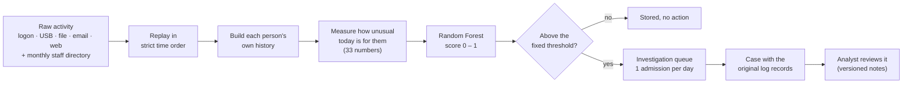

# SentinelID

### Finding suspicious behavior behind valid logins, and showing the evidence

SentinelID is a research prototype that watches how people use their accounts, notices when someone's behavior departs sharply from their own normal, and hands a security analyst a short, ranked list of who to investigate first, with the original log records attached as proof.

It is built and tested on a public benchmark of simulated company activity (CERT Insider Threat r4.2, 14.1 million events). This document explains what the project is trying to do, what has been built, how it works, what it achieved, and where it can go next.

---

## 1. At a glance

| | |
| --- | --- |
| **The question** | If a team can investigate only one person a day, who should it be, and why? |
| **The approach** | Compare each person with their own history, score the day with a machine-learning model, and admit a limited number of investigations with real evidence. |
| **The data** | CERT r4.2: 14,143,645 events from five activity logs (logon, USB, file, email, web) plus a monthly staff directory, May – November 2010. |
| **The model** | A Random Forest (100 trees) over 33 behavior measurements per person per day. |
| **The outcome** | Over November 2010 the system opened 31 investigations. 21 of them contained a known-malicious record, and 9 of the 11 planted incidents reached an analyst within 72 hours. |
| **The honest caveat** | Against a simple baseline the numbers look strong, but the project's own pre-set success rule was missed by one investigation, and the data is synthetic. So the result is *promising*, not *proven*. |
| **Where it stands** | A complete, working prototype: data download, replay, scoring, investigation queue, durable storage, and an interactive dashboard. It is a midterm research prototype, not a production product. |

---

## 2. The problem we are solving

Most security tools look for things that are *not allowed*: a wrong password, a blocked website, a known virus. But some of the most damaging incidents involve people doing things they *are* allowed to do:

- An employee copying files to a USB drive in the weeks before they resign.
- A compromised account that sends large attachments to an outside address.
- Someone who normally browses a little suddenly spending hours on unusual sites.

Every one of these actions is permitted. The credentials are valid and no rule is broken. What is wrong is that it is **unusual for that person**.

There is a second difficulty: scale. A company generates millions of log lines every day, and a security team can investigate only a handful of people. Raising an alert for every oddity would bury the team in false alarms.

So SentinelID treats this as a **ranking problem with a budget**, not a "flag everything suspicious" problem:

> Given a fixed number of investigations per day, which person should an analyst look at first, and what evidence supports that choice?

---

## 3. Our approach in one picture

The ideas that shape every part of the design:

1. **Compare people with themselves.** A system administrator who copies files all day is normal; an accountant who suddenly does is not. A personal baseline captures that.
2. **Never use the future.** Every measurement uses only what was known at that moment, so the system could in principle run live.
3. **Limit the workload.** At most one investigation is opened per day. This forces prioritization and makes the cost of that choice visible.
4. **Show the evidence, don't just give a score.** Every case links back to the real rows in the original logs.
5. **Be honest about what is proven.** Results are frozen before being measured, success criteria are written down in advance, and weaknesses are reported.

---

## 4. The data

**CERT Insider Threat Test Dataset, release 4.2**, from the Software Engineering Institute at Carnegie Mellon University.

Why this dataset? Real insider-threat data, with confirmed knowledge of who was malicious, almost never becomes public. CERT instead *simulates* a company: it generates realistic daily activity for its staff and then plants a small number of labelled malicious scenarios, such as data theft before leaving. That lets us measure whether a detector actually finds them. The cost is that simulated behavior is probably tidier than a real company's.

### What is in it

| Source | Describes | Events |
| --- | --- | --- |
| Logon | Who logged on to which computer and when | 370,699 |
| Device | USB drives connected | 177,762 |
| File | Files copied | 192,947 |
| Email | Messages: recipients, size, attachments | 1,135,158 |
| Web (HTTP) | Websites visited | 12,267,079 |
| **Total** | May 1 – November 30, 2010 | **14,143,645** |
| Staff directory | Monthly snapshot of each person's role and team | monthly |

Web browsing makes up about 87% of everything.

### How the data is handled

- It is delivered in two date ranges (May 1 – October 14, and October 15 – November 30) that never overlap and are stitched into one timeline.
- A setup step downloads exactly the needed ranges from a fixed public mirror and checks every file against a recorded fingerprint (checksum) and row count. It **never downloads the answer labels**.
- The raw files are never modified or copied. Each case remembers the exact file and position of each record it cites, and re-checks that it still points at the right record when displayed.
- A person's role and team are taken from the directory snapshot for the *same month* as the event, so a later reorganization never leaks backward into history.
- The dataset's licence forbids redistribution, so the data is not bundled with the project's code.

---

## 5. How it works, step by step

### Step 1. Replay the activity in time order
The five logs are merged into one stream, ordered by time. Out-of-order timestamps are rejected rather than guessed at. The system runs on the dataset's own clock, so the same input always produces the same output.

### Step 2. Build each person's history
For every person and every day, the system tallies: USB connections, file copies, logons, after-hours logons (before 7 a.m. or after 7 p.m.), emails to outside addresses, message size, attachments, and web visits. It also notes which computers, hours, recipients, domains and websites that person has been seen using.

### Step 3. Measure how unusual today is
This is the heart of the system. For each behavior it asks: *how far above this person's normal is today?*

It looks at a **reference window**: the person's 28 days of history ending **one week before today**. From that it learns their typical level and how much it normally varies. Today's activity is then measured against it:

> unusualness = (today's count − what we'd expect) ÷ (the person's normal variation)

Only *increases* count, and a floor on the denominator stops tiny numbers from producing wild ratios.

The **one-week gap** matters. Without it, someone escalating slowly would gradually raise their own baseline and look normal. The gap keeps the reference clean.

### Step 4. Turn it into 33 numbers
Each unusualness measure is recorded two ways, and a third group captures "newness":

| Group | Count | What it captures |
| --- | --- | --- |
| **Signed percentile** | 13 | Where today ranks within the person's own history, from −0.5 (far below normal) to +0.5 (far above). Bounded, so a huge spike and a big spike can look alike. |
| **Magnitude** | 13 | The raw size of the change (log-scaled). It keeps detail the percentile loses when it maxes out. |
| **Novelty** | 7 | Is this *new*? A computer never used before, a logon hour never seen, new email recipients, new outside domains, new websites. |

The behaviors covered: USB use (over 1, 3 and 7 days), file copying (1, 3, 7 days), days with any USB use in the last week, logons, after-hours logons, external email, message size, attachments, and web activity.

A person is only scored if there is enough history to judge them: at least 41 days on record, at least 7 active days in the reference window, and some activity today. New or long-idle accounts are skipped, because "unusual" means nothing without a baseline.

### Step 5. Score with a Random Forest
A **Random Forest** is a group of 100 decision trees. Each tree asks a series of yes/no questions about the 33 numbers, and the forest combines their votes into one score between 0 and 1. It was trained on 85,688 past person-days (June 8 – October 14) where the malicious ones were known.

Important: the score is a **ranking number, not a probability**. A 0.97 does not mean "97% likely guilty"; it means "looks very much like the known-malicious days". The model leans most on web activity and USB use, which fits the kinds of scenarios planted in the data. It does not tell you *which event* caused a score, and the system does not claim to.

### Step 6. Apply a fixed threshold (the "gate")
Scores below about **0.4056** are stored for the record but create no action. That threshold was chosen during development, on earlier data, and never adjusted afterward.

### Step 7. The investigation queue
Scores above the threshold become **candidates**, and the queue decides who actually gets investigated. At **8 a.m. each day** it admits **at most one** candidate, the highest-scoring one. Three rules keep it sensible:

| Rule | What it does | Why |
| --- | --- | --- |
| **Merge** | If someone is flagged again while waiting, combine the evidence and keep the highest score | One person, one candidate |
| **Cooldown** | After opening a case, ignore new flags for that person for 7 days | Stops one person using up the analyst's time every morning |
| **Expiry** | Drop a candidate that has waited more than 3 days | Old information is not worth a slot |

The trade-off is real and visible: on some days several people are flagged and only one can be investigated, so others expire without review. That is the price of protecting the analyst.

### Step 8. Cases, evidence and review
Each admitted case is saved permanently with the score, the day's measurements, and links to the original log records: those from the triggering day plus the previous week for context. An analyst can open any record and see the raw fields, and can record a review (status, verdict, notes). Reviews are versioned, and a stale edit is rejected so two analysts cannot overwrite each other. Feedback is stored; it does not (yet) retrain the model.

---

## 6. What has been built

| Capability | Description |
| --- | --- |
| **Reproducible data setup** | One command downloads and verifies exactly the data and model needed, resumable if interrupted |
| **Replay engine** | Streams 14.1M events in order, builds histories, scores each day, runs the queue; can be paused and resumed without loss |
| **Durable storage** | Results, cases and reviews are saved in a local database; work is checkpointed so a crash never leaves half-written state |
| **Safety checks** | Model file fingerprint, single-writer lock, and a fingerprint of the settings so experiments cannot be silently mixed |
| **Investigation dashboard** | A local web interface (below) |
| **Day-by-day replay** | A read-only playback of November showing, day by day, what was scored, who passed the threshold, who was admitted, who merged, cooled down, or expired |
| **Test suite** | 25 automated tests, none needing the large dataset |
| **Preserved research** | The earlier training, rule-based detectors and simulations are kept in a verified archive |

### The dashboard

| Tab | What you see |
| --- | --- |
| **Pipeline** | The totals (14,143,645 records → 18,772 scored person-days → 31 investigations), the six-stage flow, and the fixed policy |
| **Day replay** | A scrubbable timeline of November. Each day shows how many people were scored, who passed the threshold, who is waiting, and what the queue decided and why |
| **Investigations** | A searchable list of all 31 cases. Opening one shows the decision, the 33 measurements behind the score, the original records, and the review history |
| **Benchmark results** | The saved comparison between the two models, with definitions and limitations |

A **presentation mode** enlarges the text for projectors.

---

## 7. Method: how we kept the results honest

A model can look brilliant if it has secretly seen its test. To avoid that, the work followed a strict calendar:

| Stage | Dates | Purpose |
| --- | --- | --- |
| Choosing the design | Two earlier development periods | Pick the measurements, threshold and queue rules |
| **Final training** | Jun 8 – Oct 14 | Train the Random Forest |
| Calibration check | Oct 15 – 21 | Diagnostics only; not used for the deployed threshold |
| **Freeze** | | Model, threshold and queue rules locked |
| **Final test** | **Nov 1 – 30** | Scored once, with no tuning afterward |

Two further safeguards:

- **Success was defined before looking.** The rule said the Random Forest counts as an improvement only if it (a) costs no more investigations than the baseline, (b) reaches more incidents, (c) does not have a lower hit rate, and (d) has a confidence interval that excludes "no difference". One lucky extra catch would not be enough.
- **The answer key is walled off.** The labels used to evaluate November never feed into scoring, the queue or the dashboard's live behavior; they appear only in a saved results file.

---

## 8. Results

### The comparison
Two systems were run in exactly the same way (same queue, same one-per-day budget):

- **Random Forest (RF):** the supervised model described above, which learned from labelled examples.
- **Isolation Forest (IF):** a standard baseline that uses *no labels*; it simply scores how statistically rare a day is.

| | Investigations opened | Contained a known-malicious record | Hit rate | Planted incidents reached in time |
| --- | --- | --- | --- | --- |
| **Random Forest** | 31 | **21** | **68%** | **9 of 11** |
| Isolation Forest | 30 | 3 | 10% | 2 of 11 |

In plain terms: with one slot a day, about two out of three of the Random Forest's investigations pointed at real malicious activity, against one in ten for the baseline. It also got a relevant malicious record in front of an analyst, within 72 hours, for 9 of the 11 incidents.

Resampling the 11 incident actors 2,000 times puts the difference in incident coverage at **0.64**, with a 95% interval of **0.36 to 0.91**. That range stays well above zero, but it describes one fixed model on one month and does not capture the uncertainty from training choices.

### The verdict we actually report
> **"Unchanged: improvement not established."**

Why we say this despite the strong numbers:

1. **The pre-set cost rule was missed.** The Random Forest opened 31 investigations to the baseline's 30. The rule said no more.
2. **Unequal inputs.** The Random Forest learns from labels; the Isolation Forest does not. This compares two *working systems*, not two *methods* on equal footing.
3. **Overlap.** Two of the test incidents resemble patterns also present in the training period.
4. **Synthetic data.** One simulated month with 11 incident actors says little about a real organization or about people the model has never seen.

### What the numbers do and don't mean
- "**Hit rate**" counts investigations containing a known-malicious record from the triggering period.
- "**Reached in time**" means a relevant malicious record was admitted within 72 hours *of that record*. It is **coverage**, not accuracy, and not necessarily "caught within 72 hours of the incident starting".
- An "**investigation**" is one queue admission. It is a stand-in for cost; real analyst effort was not measured.

### An illustration from the data
The person **EDB0714** was the first admission of the month, on November 2 (score 0.97), supported by 115 original records. The same person was admitted again on November 9, 17 and 25, each time only after the 7-day cooldown had ended, with the evidence growing to 154 records. The queue handled a persistent actor the intended way: one case at a time, never flooding the analyst.

The day-by-day replay also shows the budget at work. On November 2, EDB0714 scored highly again but was held back by the cooldown, two new flags merged into people already waiting, and a different person was admitted. By November 4, five waiting candidates had expired without review.

### The funnel
**14,143,645** events → **18,772** scored person-days (918 people) → **178** above the threshold → **31** investigations (18 distinct people). Narrowing this much is the whole point.

---

## 9. Concepts and terminology

### About the data and the problem
| Term | Plain meaning |
| --- | --- |
| **Insider threat** | Harm caused by someone with legitimate access: stealing data, sabotage, fraud |
| **Account takeover** | An outsider using a stolen but valid account |
| **Synthetic benchmark** | Simulated data with known planted attacks, used so detection can be measured |
| **CERT r4.2** | The specific simulated-company dataset used here |
| **LDAP / directory** | The staff list giving each person's role and team |
| **Identity-day** | One person on one calendar day; the unit that gets a score |

### About measuring behavior
| Term | Plain meaning |
| --- | --- |
| **Baseline / reference window** | A person's own normal, taken from their last 28 days (ending a week ago) |
| **Lag** | The one-week gap that keeps a slow attacker from rewriting their own baseline |
| **Causal** | Uses only information available at that time; nothing from the future |
| **Percentile (signed)** | Where today ranks against the person's own past, from far below to far above |
| **Magnitude** | The raw size of a change, kept so very large spikes still stand out |
| **Novelty** | Something the person has never done: a new computer, hour, recipient or website |
| **Eligible** | Has enough history to be judged; otherwise not scored |
| **Peer comparison** | Comparing someone with their team. Computed for inspection but *not* used by the chosen model |

### About the models
| Term | Plain meaning |
| --- | --- |
| **Decision tree** | A flowchart of yes/no questions that ends in a prediction |
| **Random Forest** | Many trees voting together; here trained on labelled examples (*supervised*) |
| **Isolation Forest** | A method that finds statistically rare points without any labels (*unsupervised*) |
| **Score** | The model's output, used for ranking; **not** a probability |
| **Threshold ("gate")** | The fixed score (≈0.4056) below which nothing happens |
| **Frozen** | Locked before testing, so it cannot be tuned to the test |

### About the investigation process
| Term | Plain meaning |
| --- | --- |
| **Candidate** | A person-day that passed the threshold and is waiting |
| **Budget** | At most one investigation admitted per day, decided at 8 a.m. |
| **Merge / cooldown / expiry** | Combine repeat flags / ignore for 7 days after a case / drop after 3 days waiting |
| **Drain** | Three extra days after November so the waiting queue can finish |
| **Investigation (case)** | An admitted candidate with its evidence. One case is **not** one incident |
| **Evidence pointer** | The file and position of an original log record, re-verified when shown |

### About the results
| Term | Plain meaning |
| --- | --- |
| **Hit rate (current-positive)** | Share of investigations containing a known-malicious record from the triggering period |
| **Context-positive** | Same, also counting the retained earlier context |
| **Incident reached in time** | A relevant malicious record admitted within 72 hours of that record |
| **Confidence interval** | The range of plausible values after resampling the 11 incident actors |
| **Improvement not established** | The pre-set success rule was not fully met, so we do not claim superiority |

---

## 10. Strengths and limits

### What is strong
- A **complete path** from raw logs to reviewable cases, running end to end.
- **Causal design**, so results are not inflated by future information.
- **Evidence-first**: every case points to real records, and the system is explicit that it does not know which event drove a score.
- **Reproducible and recoverable**: verified downloads, checkpointed progress, deterministic replay.
- **Honest evaluation**: frozen before testing, success defined in advance, weaknesses reported.

### What is limited
- **Simulated data, one test month, 11 incident actors.** Nothing here proves performance on real organizations or new people.
- **The budget loses candidates**, since some flagged people expire before review.
- **No explanation per event.** We show the measurements and records, not which event the model "used".
- **Bad results with unsupervised learning** Isolation forest does not give best yields.
- **No outage awareness.** The system assumes complete logs; it cannot yet notice that a feed has gone quiet.
- **Local prototype.** No login system, no connection to live company systems, and saved model and progress files should only be loaded from a trusted source.
- **Feedback does not learn.** Analyst reviews are recorded, but they do not yet improve the model.

---

## 11. What comes next

### To strengthen the evidence
1. **Independent evaluation** on different time periods and different people, the single most important next step.
2. **Measure analyst effort** instead of counting investigations as a stand-in for cost.
3. **A fair comparison** with a label-free method tuned equally, or a supervised baseline, so the label advantage is controlled.
4. **Resolve the known magnitude quirk** by adopting and validating the corrected version.

### To improve the system
5. **Smarter admission:** reduce candidates lost to expiry, refresh evidence for people who wait, and allow reopening when genuinely new behavior appears during a cooldown.
6. **Explanations:** show which behaviors and which events contributed most to a score.
7. **Learning from analysts:** use reviewed outcomes to recalibrate or retrain, with safeguards against feedback loops.
8. **Peer context in the model:** test whether comparing with teammates adds value.

### To make it real
9. **Source-quality monitoring:** detect missing or delayed log feeds, and avoid mistaking an outage for quiet behavior.
10. **Live connectors:** read from real log and identity systems instead of replaying files.
11. **Security hardening:** authentication, access control, and a safer way to save progress and models.
12. **Faster replay:** resume without rescanning, to support near-real-time use.
13. **Broader signals:** add more activity types and richer content-level context, subject to privacy review.

### Longer-term ideas
- Multi-day or multi-person attack patterns, rather than one person-day at a time.
- Adaptive budgets that grow when many strong candidates appear.
- Fairness and privacy review of how behavioral monitoring affects employees.
- More types of models to be tested, anomaly detection, unsupervised, neural/graph etc.

---

## 12. Summary

SentinelID turns fourteen million raw activity records into a handful of explained, evidence-backed investigations. It does this by measuring each person against their own past, scoring the result with a Random Forest, and spending a fixed daily investigation budget on the strongest candidates. On a simulated benchmark it reached 9 of 11 planted incidents with a 68% hit rate, far above a label-free baseline. But by its own pre-declared standard the improvement is **not yet established**: the cost rule was missed by one investigation, the data is synthetic, and independent validation is still needed.

The pipeline, storage, replay and dashboard are complete and working. The open work is mainly about *proving* the idea on independent data, and about making the system explain itself, learn from analysts, and handle real-world data feeds.

---

## 13. Quick facts

| | |
| --- | --- |
| Events processed | 14,143,645 (May 1 – Nov 30, 2010) |
| Activity sources | Logon, device (USB), file, email, web + monthly directory |
| Person-days scored | 18,772 across 918 people (November 2010) |
| Passed the threshold | 178 |
| Investigations opened | 31 (18 distinct people) |
| Model | Random Forest · 100 trees · depth 8 · 33 inputs · trained on 85,688 person-days |
| Threshold | ≈ 0.4056 (fixed in advance) |
| Queue | 1 per day at 8 a.m. · 7-day cooldown · 3-day expiry |
| Random Forest result | 31 investigations · 21 hits (68%) · 9 of 11 incidents reached in time |
| Isolation Forest result | 30 investigations · 3 hits (10%) · 2 of 11 incidents reached in time |
| Difference in incident coverage | 0.64 (95% interval 0.36 – 0.91) |
| Verdict | **Unchanged: improvement not established** |
| Dataset | CERT Insider Threat r4.2 (CMU SEI, synthetic) |

*Dataset attribution: the synthetic CERT Insider Threat Test Dataset is published by the CMU Software Engineering Institute (Copyright © 2011 ExactData, LLC). Its terms restrict redistribution; obtain it from the official source.*
